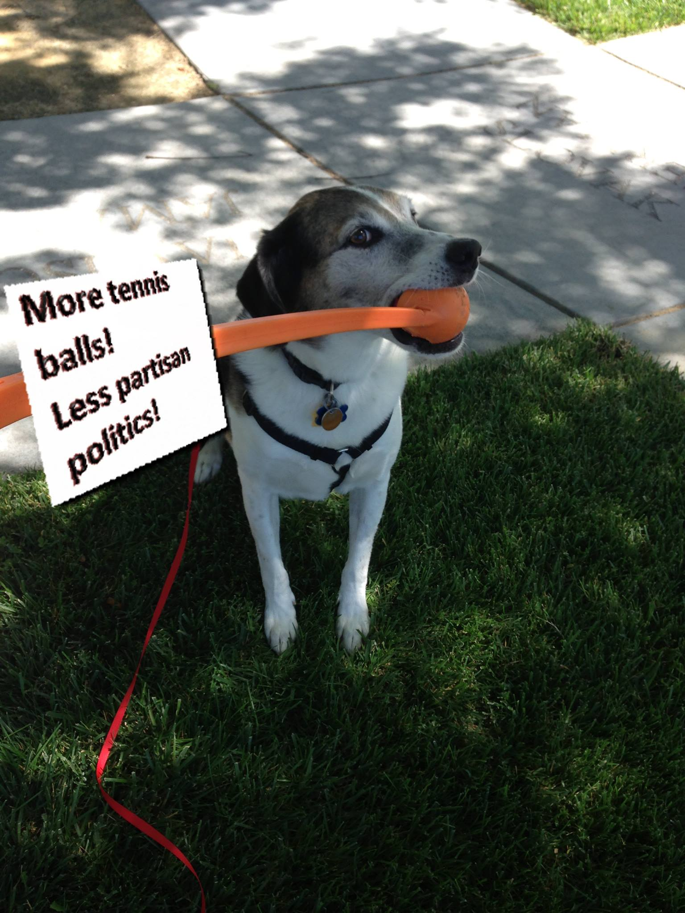

# And finally, today

<small>
    **Author:** Riley  
    **Date:** Jun 4, 2020  
    **Read time:** 3 min  
    **Updated:** Jun 5, 2020
</small>

---

So here we are, now in June of 2019. I'm not exactly bionic, but I feel better than I have in years. Some days, I even start running on our way to the lake. I remember being told that I would never run again, and yet sometimes I can't resist. When the air is cool and the wind is in my face, I just can't stop myself.

Well, until I get to a hill. Running up hills is not fun, and I don't understand why anyone would do that.

We're coming up on our third month of quarantine. But as I've stated before, I don't notice anything very different, except the guy's hair is really big, and the lady's hair is turning gray like my fur.

So what does quarantine mean? I think it means that more homes get dogs. Dublin, the young golden retriever, came to the neighborhood in December, along with Klondike, (a chocolate lab who is a brother of Kona). Dublin and Kona are the smartest of the new group, and Klondike is showing promise - although I still have to put him in his place sometimes. We also have some, how do I say, more special pups. There's the little terrier who likes to run in the street, and the little beagle who freezes and refuses to move when he sees me. (Does he think he's invisible?) Vader, the lab mix, loves to bark. Kimchee, the very young German Shepherd, has an owner who walks him without a leash or poop bags. And there's another young Sheltie mix. I can't remember her name, but let's just say she's very pretty (which is also code for "not too smart").

After evaluating all of these new recruits, I've decided to focus my attention only on Dublin, Kona, and Klondike because, and here's the big news, I've decided that after devoting more than a decade of my life to fighting terrorists, it's time for me to retire.

Don't worry, I'm still going to remain involved in counter terrorism and defending my country, but I will focus more on consulting and training. King, Dublin, and Kona are already coming along nicely, and I also have high hopes for Klondike. Yes, these new recruiters have already started their training. On weekends, I meet up with the cadets in Dublin's yard. He has several acres fenced in, so young Klondike won't run away. His yard has a splash pool, a pickle-ball court, and most importantly, lots of toys that we can use for training and to practice sniffing out bombs. The humans seem to enjoy this time too, though they don't understand that this is serious and it isn't all fun and games. They stand around and watch us train, while they chitchat (staying mindful of social distancing rules).

I will spend these upcoming summer months continuing to train my replacements. There may even be a mission or two that we have to go on. Over the twilight bark, I've been hearing about protests, rioting, and police brutality in nearby cities. (We all know that instances of police brutality are actually carried out by terrorists disguised as Americans.) If those rioters and terrorists start moving into my territory, well, let's just say, it's been a while since I've participated in a protest, but if it comes to it, we will be ready to attend and defend.

{ style="width: 60%" }
