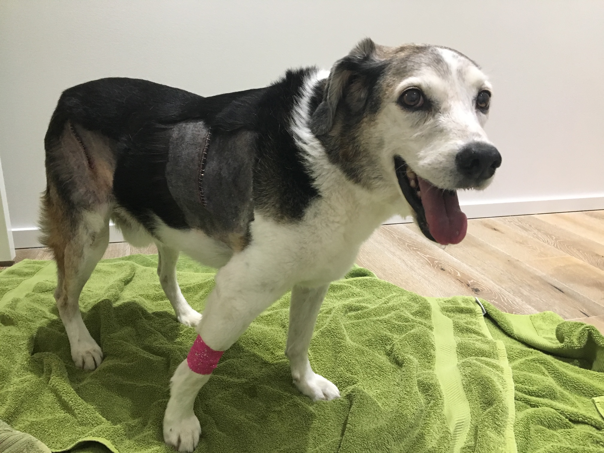

# Goodbye fatty tumors

<small>
    **Author:** Riley  
    **Date:** May 16, 2020  
    **Read time:** 2 min
</small>

---

It was early May 2019 when I went to the vet for what I was expecting to be a routine dental cleaning. At 14 years old, being put under anesthesia can be a pretty big deal, but taking care of your teeth is still important. I've met some dogs who had bad teeth, and they were all not smart. And yes, I understand that I've had several of my own teeth pulled, but I blame that on one specific evil doctor. No other evil doctors had ever before or have ever since tried taking away my teeth.

When I was dropped off for my cleaning, the guy and lady started taking to the evil doctor about fatty tumors. I knew I had tumors. The protrusions on the right side of my body were hard to miss, but, they weren't harmful. Still, I had no idea what was about to happen.

I don't remember much, having blocked out from my memory what happened immediately and in the two days that followed. The lady told me everything, though. She said the tumor removed from my shoulder was about the size of a baseball or orange. The tumor removed from my hip, though, was the size of a small cantaloupe. Also, that large tumor was attached to a muscle, and the surgery was difficult. I came home that day sedated but still in pain. I couldn't move that leg at all without great shrieking. The only time I was comfortable was when I was standing still, and I seemed determined to stay in that position. I refused to lay down. More than once, I dozed off while still standing and ended up falling down. I couldn't walk up or down stairs, and at the same time, the lady and guy couldn't pick me up without causing me excruciating pain. The harness was not much better. I shrieked, growled, and snapped each time I had to be taken out.

According to the lady, that first night I slept about 2 hours total. She knew because she was awake the entire time too. The next day, I forced myself to lay down, and I even slept for a few hours. But that second night wasn't any better than the first. Still, there was nothing anyone could do but wait it out.

Things were definitely improving by the third day. This is where I start remembering. I imagine that the shame of being carried up and down the stairs and being aggressive toward the lady were too much for me and caused my memory loss. By day three, though, I remember I was in pain, but I was still able to lay down and go up and down the stairs in my harness. I napped during the day and finally slept that night.

{ style="width: 75%" }

Looking back, that fatty tumor removal surgery was a success, and I even lost a couple pounds as a result. I'm much more svelt now and once again look like the leader that I am. Today, one year later, I have lots of energy and can move without any discomfort. The lady thinks that the CBD helps.
