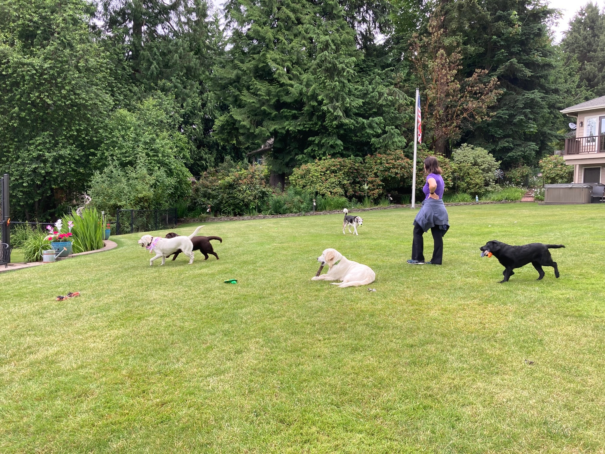

# Lola's Birthday Party

<small>
    **Author:** Riley  
    **Date:** Jun 16, 2020  
    **Read time:** 2 min
</small>

---

Last week, the lady and I were invited to my very first canine birthday party. Lola, a yellow lab, was turning 2 years old in human years. A canine birthday party, seriously? Yeah right! I knew better. Based on the elite list of canines who attended this party, it was clear that Lola was using this as a tryout to join our local counterterrorism force.

Lola lives on a different street, but her party was in Dublin's yard. She was obviously trying to point out that she fits in with the rest - and after meeting her, she might be right. Others who attended included Dublin (obviously), Kona, Klondike, and a one-year-old golden doodle from another street named Ozzy. I'm not sure what Ozzy was doing there. Was he trying out too? He was young and lacked focus, but I'm going to keep an eye on him. If Lola and Ozzy both work out, then we will be able to expand our territory.

The party was a nice respite for them from training. They've all been showing such promise, that they all deserved a break. And the highlight of the party were the peanut butter pupcakes with a yogurt frosting.

So just a reminder that I'm 15 in human years. The rest of the party were 2 or younger. And this was my first pupcake. I'm going to suggest to the lady that she make these sometimes because all dogs need to experience pupcakes - and older dogs especially so.

{ style="width: 75%" }

Ozzy's birthday party is coming up this week. I want to go and see how his training has been progressing since he first joined us. But the lady might not let me attend. I suffered an injury at home a couple of days ago to my back leg, and I'm not able to walk down the stairs by myself. I need to get better in the next couple of days, or the guy and lady are threatening to take me to the vet. And attending a party with a bunch of young dogs might not be the best way for my leg to heal. During the twilight bark tonight, I'll ask Dublin to save me a pupcake if I can't make it.
