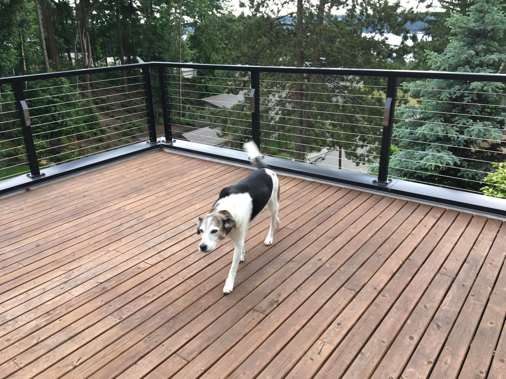
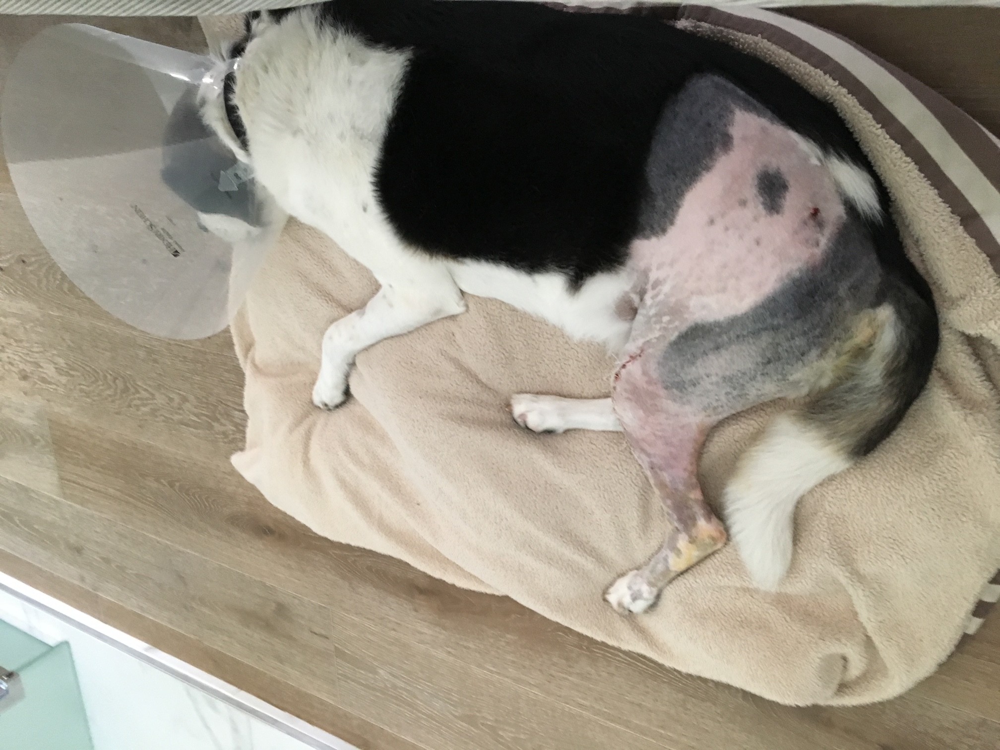

# Moving to Washington

<small>
    **Author:** Riley  
    **Date:** Apr 23, 2020  
    **Read time:** 3 min  
    **Updated:** Apr 24, 2020
</small>

---

So we were moving again. I would have to make new connections and find new assets, all while suffering this horrible injury that didn't seem to be healing.

The condo in San Jose sold before we had a new place to move in to. The lady spent several weekends in Washington looking for houses. I heard them discussing being outbid twice. (Was that some kind of plot?) But we had to get out of our condo soon because it would shortly no longer be ours.

The lady found a temporary apartment. Once that happened, she and I were packed into her little car with a suitcase, an air mattress, and my beds, and we were on the road. The guy would follow a week later.

We stopped for a night at a safe house in Oregon. We also had to stop for gas in Oregon, and the gas station attendant would not let the lady get out of the car. I immediately didn't trust him, and I barked at him as he pumped our gas. Still we eventually made it out of Oregon safely (I assume before the rebel was able to call for backup), and by that Saturday afternoon, we were pulling in to our new, temporary home.

The lady and I went into the leasing office. Having lived in apartments before, I knew that we would be evaluated. I played dumb because most dogs in the apartments I've lived in are dumb, and the lady signed some paperwork. Not surprisingly, we both passed inspection (we were professionals, after all), and we were given the keys.

That first night was rough. It didn't smell right to me, and I wasn't sure we were safe. This was unknown territory again. The lady unpacked her suitcase, set up the air mattress, and then went out for supplies. The next day, she left to go looking for a house again. I should have gone with her because I of course knew best where we should live, but I was left to guard our new apartment. I took it as an opportunity to get to know the neighbors and bark at the maintenance man who tried to come in.

The guy finally arrived the following weekend. (He was fortunate to not have to stop in Oregon.) I was happy to see him. After all, if we were to be attacked, someone would probably go after him first, so the lady and I would have a better chance at escaping. ("Bless your sacrifice, guy!") The next day, they both went out with their realtor to look at houses. And after the lady looked at countless houses and put in multiple offers, they came back home that evening and had bought a house. We would be moving in the next month. I had a little bit of respect for the guy after this. He must have been a real estate genius, finding a house after only going out to look once.

I remember the first time driving up to the new house. The lady put me on a leash as we got out of the car, but she took it off after a neighbor dog came running to greet me.

King is a German shepherd, much younger than me. I immediately decided that he would make a good asset. (He was smart, and he too was a tennis-ball sniffing dog.) I also met a Britney Spaniel who lived across the street. Belle wasn't much of a spy - she was more local law enforcement. She had a single job that she was very good at. She was to protect her house and her chickens. I was able to charm her and convince her that she needed to expand her territory, and that soon included our house.

Our house in Washington is larger than our home in Michigan, and there are even more stairs. I inspected every inch of the house, from the garage to the roof. Yes, this house will do.

{ style="width: 75%" }

Life was starting to return to normal again, and I felt much better having found such sharp recruits. With King and Belle on the job, I no longer had to hide my injury. I was ready to have my surgery. And so I did … I had my first ACL surgery shortly after moving into our new house. More on that shortly.

{ style="width: 60%" }
