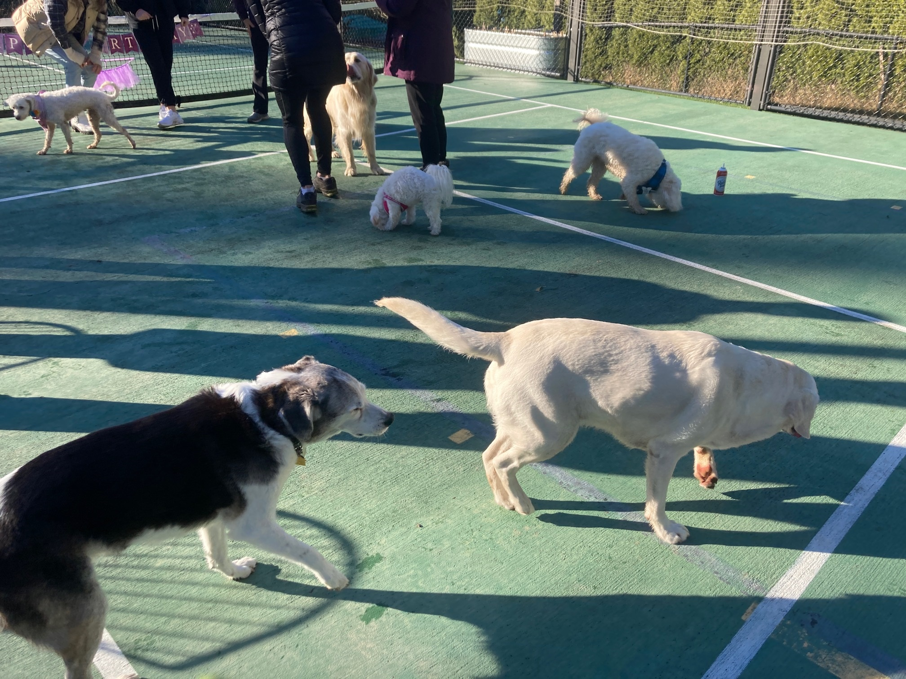

# Phase 2

<small>
    **Author:** Riley  
    **Date:** Jun 23, 2020  
    **Read time:** 2 min
</small>
---

Sunday I did something I haven't done in as long as I can remember (if ever). I slept in until 8:50 am. (Normally I wake up between 5:45 and 6:45 every morning.) But I was fresh for Ozzy's party.

Let me back up. The county we live in is currently in "Phase 2," which apparently means that the guy and lady can leave the house. On Saturday, they went to a friend's house in Seattle for dinner. Everything seemed normal during planning. I knew where they were going, and I had vetted and re-vetted their friends over the years.

The dinner was supposed to be just five of them. Then on Saturday morning, the guy and lady found out that two more people would be coming. Then shortly after that, they found out that one more person would be coming (which turned out to be 3 more people).

By the time the guy and lady were to leave, the lady's heart rate was up. I knew she was concerned about the number of people who were attending. I was concerned as well. I didn't know any of the new additions to the guest list and had no way to vet them. I didn't want the guy and lady to go.

The guy and lady talked for over an hour about whether they should go. They'd planned this dinner for a couple of weeks. The lady even made kouign-amann that looked and smelled delicious. In the end, they decided to go, and it freaked me out. I don't really know what COVID is, and I was scared they would bring it back. Would it turn the lady into a monster?

They finally came home from dinner at 11:00 pm that night. Normally I get my last walk and a drink of water sometime around 9:00 pm, which is several hours into my "after-dinner" nap. Well because I was worried about them, I didn't have a good after-dinner nap, and my walk was two hours later than normal. So it wasn't until about 11:30 pm when I finally was able to relax. Thankfully, the guy and lady both looked the same. Apparently, they didn't get the COVID. And that's why I slept in until almost 9:00 am, which also meant that I was fresh for Ozzy's party!

{ style="width:70%" }
