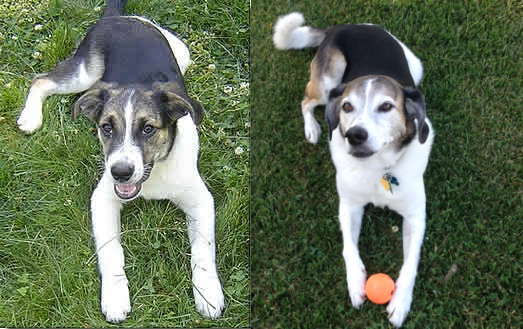

# Riley first blog post

<small>
    **Author:** Riley  
    **Date:** Apr 10, 2020  
    **Read time:** 2 min
</small>

---

Today is day 24 of what the guy and lady call "self quarantine." That's about 168 days in dog years!

I don't really know what self quarantine means, but because we haven't visited St. Edward State Park in months, I understand that it means no more walking on trails. Meeting other dogs on my daily walks on the street, it seems like other dogs are upset that their guy and/or lady are home all the time. This isn't new for me though. The guy and lady almost never leave the house.

Because I don't know when or if I will ever get back to the trails, I thought I'd spend my free time creating this blog for you. I'm imagining now how lucky you feel to finally get to know me.

According to the lady, the charts say that I'm about 83 in dog years, or 15 human years. Being this age, I have a lot of information that you will blessed to learn through this blog. But first, you should know a little about my history.

My three siblings and I were abandoned on a farm in Kentucky when we were only a few weeks old (in human years). The farm was nice, but the guy soon sent us to live in a cult in Michigan: the Great Lakes Border Collie Rescue Cult, to be specific. This cult focused on health, and my sister and I were not healthy enough at first to live there. We spent a month with a monster (called a "vet") being treated for something called "parvo." I also had to undergo an emasculating surgery. (I was ashamed to admit this for years, but I've learned to be more vocal about "neutering.")

After a few months with the cult, I was sold to the guy and lady. I was about 5 months old (in human years) at the time, and I was happy to have another 4-legged pal. He was called "Winston," but he told me that he preferred being called "Prime Minister."

... I'm sure you're hanging on every word an anxious to learn more, but it's time for my walk now and then my nap. In the meantime, please enjoy looking at pictures of me from then and now. And you're welcome for my time.

