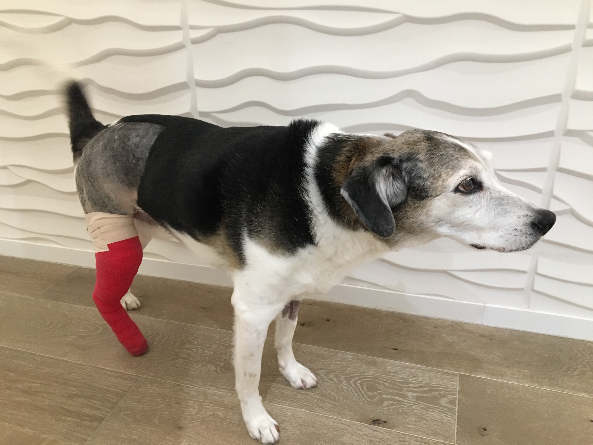
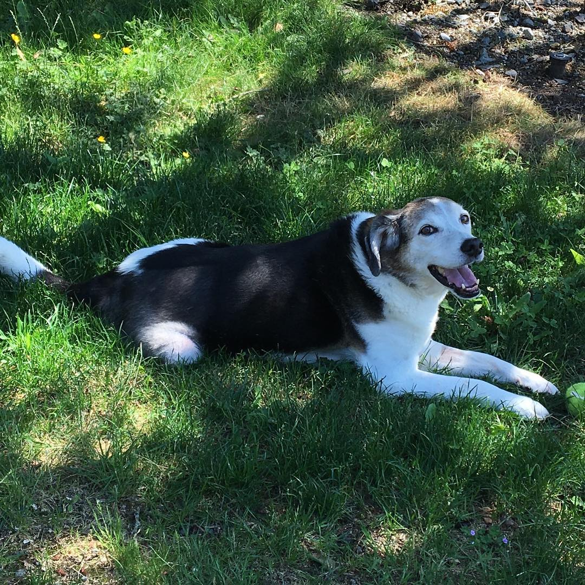

# Surgery and Recovery 2.0

**Author:** Riley  
**Date:** May 7, 2020  
**Read time:** 3 min  
**Updated:** May 15, 2020

---

So a freak fetching accident in May 2018 left me with a torn ACL on my right leg. After my first surgery, the evil doctor warned us that if one ACL is bad, it's only a matter of time before the other leg goes bad. I hate admitting that he was right and that maybe he was smarter than I thought.

You would think I was a pro at surgery after what I went through the year before, but the second surgery was no easier. After the first surgery, I stayed in a small cell at the vet center for three days. I wasn't doing that again. A day after my second surgery, I made the vet call the lady and tell her to pick me up. He gave a story that I was not eating, and I was aggressive toward the staff when they would try to feed me or give me my antibiotics. My plan worked, and I was able to convalesce at home.

{ style="width: 75%" }

Again the vet sent me home with strong drugs, but this time I refused to take them. The lady and guy prepared for this, though, and found a new solution called CBD. Two days later, I was eating normally and taking my antibiotics willingly. I was quickly back on the harness and not suffering the embarrassment of being carried up and down the stairs. And after only two weeks, I was able to walk up and down the stairs on my own without a harness. Maybe I was a pro at surgery because this recovery was much easier and and I healed much more quickly.

That summer was a hot one. I thought that when you got older, your blood got thinner and you were always cold. I remember one spring when we lived in Downtown San Jose when the lady's parents came to visit. They were older and always seemed to be cold, even as the guy and lady would be sweating. But that's not the case with me. I've learned that I prefer the 45-55 degree range, and I admit that it was sometimes difficult for me to locate tennis balls on the 90-degree days. I was grateful for any shade.

{ style="width: 75%" }

I was completely healed by summer's end, and the lady and I started hiking more and more at a local state park. There was always a lot to sniff there, and it was a great place to meet new dogs and new potential recruits. Unfortunately, I still haven't found one that I would add to my team, but for the safety of our nation, I will not stop looking.

The rest of 2018 was uneventful. Lots of people came and went in the house that year. Who knew the guy and lady were so popular? I enjoyed some of the attention, but I didn't need the attention of children. I have no patience for them, and they are of no use to me. Plus they smell.

As the year came to an end, I was anxious for what 2019 would hold. There was so much promise! My legs were healed, and the lady and I were always meeting other new dogs. And then came February. February is when I would normally get my teeth cleaned. But this time was different. This time, in addition to getting my teeth cleaned, the guy and lady asked the evil doctor to also remove some fatty tumors. And that would result in the worst surgery and recovery I've ever experienced. More on that next time.
