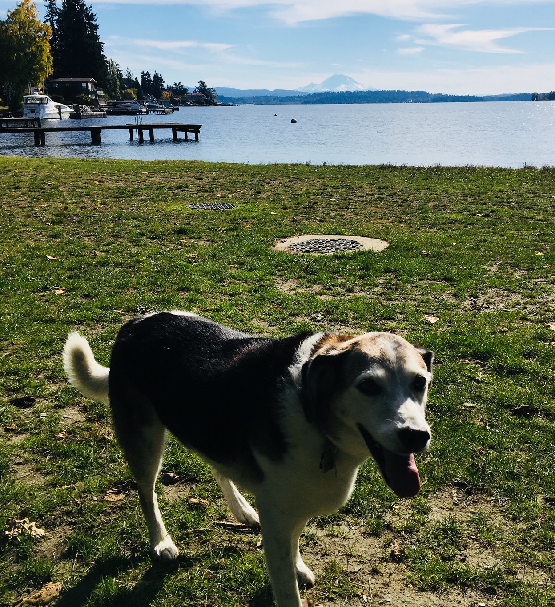
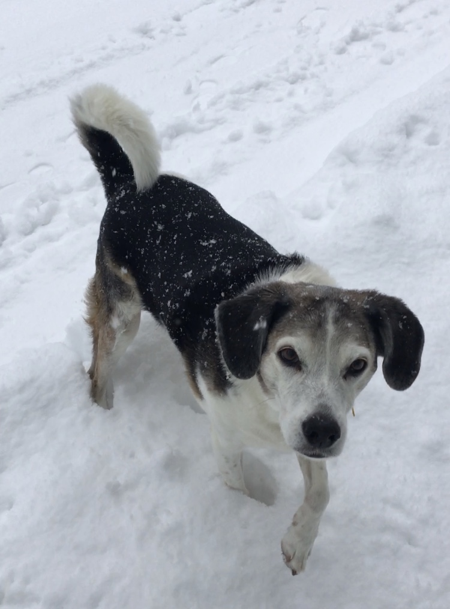

# Surgery and recovery

<small>
    **Author:** Riley  
    **Date:** Apr 29, 2020  
    **Read time:** 2 min
</small>

---

That first ACL surgery was performed on my left leg in the summer of 2017, just a couple of months after moving to our new house. It was a difficult time in my life. The pain was unbearable, the drugs made me queasy and dizzy, and on top of everything, I had to suffer the embarrassment of being carried up and down the stairs. What happened to my life? I was a covert ops canine who spent my life saving the world from terrorists and cats. Now here I was, completely dependent on the humans.

After a few days, the guy and gal found a harness that allowed me to walk up and down the stairs with their help. Being dragged up and down the stairs was less humiliating than being carried, and I was slowly able to start putting weight on my leg. That first step was what I needed to improve my mood. If I could put a little weight on it, then I could work up to more and more weight until I regained my confidence and strength. Covert ops canines never give up!

Several weeks later, I was walking up and down the stairs on my own. The gal took me outside to practice walking on hills and to practice walking backward. These were the final tasks in my therapy, and by the end of Fall, I was at full strength, going on 2-to-3 mile walks. I felt like a new pup again! But the gal would not allow any running. So although my tennis-ball-sniffing skill were still useful, my fetching days were over. It was okay, though. I could leave that to King.

{ style="width: 75%" }

That winter, something incredible happened. It snowed! I hadn't seen snow since we left Michigan. I played around in it for a few minutes until I remembered that I hate snow. I've heard of dogs who pull their humans on sleds in the snow. What kind of dogs would subject themselves to this torture? Maybe my next mission will be to free them. Or maybe they're just not smart.

{ style="width: 75%" }

Eventually, spring came. The gal and I were taking regular hikes around our neighborhood and at our local state park. King and Belle were proving to be great recruits, and they continued to save the neighborhood from rabbits. And then one day in May, when I was feeling quite spritely, the gal tossed a tennis ball in the air toward my nose. (Even though I couldn't fetch anymore, we could still practice my abilities at retrieving and diffusing tennis balls.) The ball bounced off my nose. I twisted awkwardly to keep it from exploding on the ground when the "now imaginable" happened. This time to my other leg.
