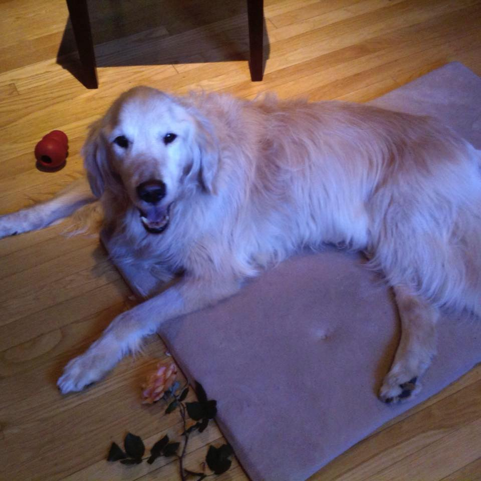
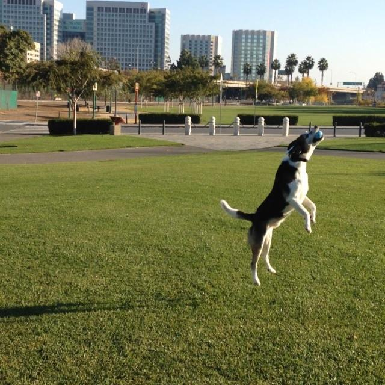

# The California years

<small>
    **Author:** Riley  
    **Date:** Apr 14, 2020  
    **Read time:** 3 min
</small>

---

We made it to California in May 2008 and moved into a 2-bedroom apartment. I wasn't used to living in such tight quarters, but the guy and lady made sure that the Prime Minister and I had plenty of walks. I took it upon myself to serve as the head canine for the entire complex, keeping an eye out for any potential Nazi threats. We lived near a tennis court, and every day I would go to work bomb sniffing while the Prime Minister sniffed the flowers. (Bombs are known to be hidden in tennis balls.) In addition to large threats like rogue tennis balls, there were often minor infractions occurring in the complex too, such as unwelcome sniffing, ringing doorbells, etc. I left those to be investigated by trained bichon frises. (In chess, you always send your pawns out first.)

A year later, we moved into a two-bedroom house. At last, a yard once again! This was much farther from the lady's job, and her long commute took a toll on both the Prime Minister and me. Sadly, in 2010, the Prime Minister had enough of the neglect and went to live in a farm upstate. I heard the guy and lady talk about "cancer came back," but I knew better. Not wanting to suffer the same fate, I decided that it was time to move.

{ style="width: 75%" }

My plan worked, and in 2011 we moved into a one-bedroom apartment. It was small, but we had a nice stoop where I could sit and keep track of the chickens at the farm on the other side of the fence. I made sure to herd them if they got too close. They knew better than to "cross the road" into our back patio.

The lady was not happy in this place. Apparently a threat lived upstairs. Based on his alarm, I surmised that he would get his orders every morning at 6:15. I think he didn't want anyone to hear what those orders were because he would leave his alarm on to drown out any other sounds in his apartment. He would finally turn off his alarm about 30-40 minutes later. But by then the damage was done, and the lady was awake. I decided we needed to move again.

After a year living beneath a potential national security risk, we moved once more. This time, the guy and lady bought a condo. I don't know why they needed one because they already had a secret condo/safehouse in a place called Vegas. (It was so secret, even I hadn't been there.) These years were the best of our time in CA, and I wish the Prime Minister had been there with us. We lived in a high rise with many other dogs. Again, I made sure to let all canines know that I volunteered to be in charge, and I would keep them all safe. Some canines didn't seem to appreciate my selflessness, and others didn't even seem smart enough to know that we were under constant threat. (The poodle on the 15th floor would always respond to my greeting with, "Don't I look gorgeous today?")

Our condo was in a downtown area near a large park, and I allowed the guy and lady to throw tennis balls to me whenever they wanted. Secretly, it was an opportunity for me to do my daily canvas of the area.

{ style="width: 75%" }

In 2017, the guy and gal started packing again. I heard them talk about moving to Washington, and I don't mean DC, where I could do the most good. I wasn't sure how I felt about this. On the one hand, I was happy with my life in the big city, but I was also becoming comfortable. Too comfortable, in fact. One evening after packing, the guy and gal took me to a dog park. While I was protecting other dogs from balls (or potential bombs) being thrown in every direction, I landed incorrectly and suffered a career ending injury.

... but more on that after the move to Washington.
