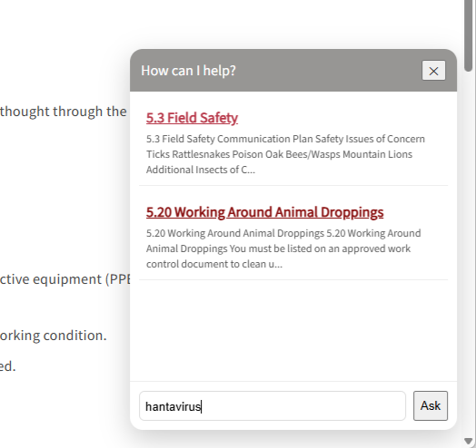

# Building a free search chatbot for a MadCap Flare help system

<small>August 12, 2026</small>

I recently wanted to experiment with adding a chatbot-style search experience to a MadCap Flare help system, but I had a few constraints:

- The help system is internal and requires authentication.
- I didn't want documentation content sent to an external AI service.
- I wanted to avoid API or hosting costs.
- The help system is relatively small, so I didn't need a full search platform.
- I wanted the chatbot to work with the existing Flare HTML5 output.

Here's how I built it.

## Is it really a chatbot?

Not exactly. It's more of a lightweight, client-side search assistant. It loads a JSON index of the documentation, searches it in the browser, and returns the most relevant help topics.

There's no large language model that interprets the user's question and generates an answer. It's better described as a **chat-style documentation search assistant**. But for my use case, this simplicity has some advantages.

There's:

- no AI API or API key
- no per-query cost
- no vector database
- no additional backend work or requirements
- no need to send internal documentation to an external model

For my small internal help system, this was enough. And because the search index is generated from the actual Flare HTML5 output, the assistant stays closely tied to what users can really access.

## Requirements

These are the tools I used for this project.

- MadCap Flare to create and build the help system 
- VS Code editor to create scripts and style sheets
- Python to crawl the documentation
- Live Server extension in VS Code

## How it works

The finished system has three main pieces:

1. A Python crawler that reads the generated Flare HTML5 topics and creates a JSON search index
2. A JavaScript search widget that loads that JSON file and searches it when someone asks a question
3. A CSS stylesheet that turns the search interface into a floating chat widget

The basic architecture looks like this:

```text
MadCap Flare
     │
     ▼
HTML5 Output
     │
     ▼
Python crawler
     │
     ▼
flare_docs.json
     │
     ▼
JavaScript search
     │
     ▼
Floating chat widget
```

Everything happens locally in the generated help system. **None of the documentation is sent to an external service**.

## Step 1: Crawl the Flare HTML5 Output folder

The first step is to build the Flare HTML5 output and then crawl the resulting output folder. Crawling the output folder ensures that the search index represents what users can actually access. 

For example:

```text
Output
└── AB
    └── HTML5
        ├── Foreword.htm
        ├── Section1
        ├── Section2
        ├── Section3
        └── Resources
```

The Python crawler uses Beautiful Soup to read each generated `.htm` file.

```python
from pathlib import Path
from bs4 import BeautifulSoup
import json

# =====================================================
# CONFIGURATION
# =====================================================

# Root of the built Flare HTML5 output.
# This directory corresponds to "/" when you run Live Server
# from the HTML5 folder.
HTML5_DIR = Path(
    r"C:\Users\AB\Desktop\Flare projects\lbre-guides-copy\Output\AB\HTML5"
)

# Where to save the generated JSON file.
OUTPUT_FILE = HTML5_DIR / "Resources" / "flare_docs.json"


# =====================================================
# CRAWL BUILT FLARE TOPICS
# =====================================================

docs = []

for file in HTML5_DIR.rglob("*.htm"):

    # -------------------------------------------------
    # Skip files that aren't actual help topics
    # -------------------------------------------------
    # We can add exclusions here later if Flare's
    # generated support files start appearing.
    
    with open(file, "r", encoding="utf-8") as f:
        soup = BeautifulSoup(f, "html.parser")

        # ---------------------------------------------
        # TITLE
        # Prefer the topic H1.
        # Fall back to the HTML <title>.
        # Finally fall back to the filename.
        # ---------------------------------------------
        h1 = soup.find("h1")

        if h1:
            title = h1.get_text(" ", strip=True)
        elif soup.title:
            title = soup.title.get_text(" ", strip=True)
        else:
            title = file.stem

        # ---------------------------------------------
        # REMOVE NON-CONTENT ELEMENTS
        # ---------------------------------------------
        for tag in soup([
            "script",
            "style",
            "nav",
            "header",
            "footer"
        ]):
            tag.decompose()

        # ---------------------------------------------
        # REMOVE MADCAP BREADCRUMBS
        # ---------------------------------------------
        for tag in soup.select(
            ".MCBreadcrumbsBox, "
            ".breadcrumbs, "
            ".MCBreadcrumbsProxy"
        ):
            tag.decompose()

        # Remove any remaining "You are here" text
        for element in soup.find_all(string=True):
            if "You are here" in element:
                element.extract()

        # ---------------------------------------------
        # EXTRACT SEARCHABLE TEXT
        # ---------------------------------------------
        body = soup.find("body")

        if body:
            text = body.get_text(" ", strip=True)
        else:
            text = ""

        # ---------------------------------------------
        # CREATE WEB URL
        # ---------------------------------------------
        # Example filesystem path:
        #
        # ...\HTML5\Section1\code-of-safe-practices.htm
        #
        # becomes:
        #
        # /Section1/code-of-safe-practices.htm
        #
        relative_url = file.relative_to(HTML5_DIR).as_posix()
        url = "/" + relative_url

        # ---------------------------------------------
        # SECTION
        # ---------------------------------------------
        relative_parent = file.parent.relative_to(HTML5_DIR)

        if str(relative_parent) == ".":
            section = ""
        else:
            section = relative_parent.as_posix()

        # ---------------------------------------------
        # ADD TOPIC TO SEARCH INDEX
        # ---------------------------------------------
        docs.append({
            "id": file.stem,
            "title": title,
            "url": url,
            "section": section,
            "text": text
        })


# =====================================================
# WRITE JSON
# =====================================================

# Make sure Resources exists.
OUTPUT_FILE.parent.mkdir(parents=True, exist_ok=True)

with open(OUTPUT_FILE, "w", encoding="utf-8") as f:
    json.dump(
        docs,
        f,
        indent=2,
        ensure_ascii=False
    )


# =====================================================
# SUMMARY
# =====================================================

print(f"Extracted {len(docs)} topics")
print(f"JSON written to:")
print(OUTPUT_FILE)

# Show a few URLs so we can verify them.
print("\nSample URLs:")

for doc in docs[:5]:
    print(f"  {doc['title']}")
    print(f"  {doc['url']}")
```

This removes any "You are here" breadcrumbs from the resulting JSON. It also uses the output page's H1 heading as the search result title. And it generates URLs based on the published site's structure, not the project's filesystem structure. 

The resulting JSON looks something like:

```json
{
  "id": "code-of-safe-practices",
  "title": "1.4 Code of Safe Work Practices",
  "url": "/Section1/code-of-safe-practices.htm",
  "section": "Section1",
  "text": "The Code of Safe Work Practices..."
}
```

## Step 2: Verify the generated JSON file

The Python crawler saves the generated search index to the Resources folder in the built HTML5 output:

```text
Output
└── AB
    └── HTML5
        └── Resources
            └── flare_docs.json
```

When the HTML5 folder is served as the site's root, the chatbot can access this file at /Resources/flare_docs.json.

## Step 3: Add the chat widget script to the Flare project

Getting the chat widget script to work correctly took a lot of trial and error. I created a file called chat-widget.js and stored it in the Content folder at:

```text
Content
└── Resources
    └── Scripts
        └── chat-widget.js
```

The entire script is here:

```js

/******************************************************
 * FLARE CHAT WIDGET — STABLE PRODUCTION VERSION
 ******************************************************/

console.log("[FlareChat] loaded");

window.FlareChat = window.FlareChat || {
  docs: [],
  loaded: false,
  widgetReady: false,
  state: {
    isOpen: false
  }
};

/* =====================================================
   CONFIG
===================================================== */
const CONFIG = {
  jsonPath: "/Resources/flare_docs.json"
};

/* =====================================================
   LOAD DOCS (SAFE + ONCE)
===================================================== */
function loadDocs() {
  if (window.FlareChat.loaded) {
    return Promise.resolve(window.FlareChat.docs);
  }

  return fetch(CONFIG.jsonPath)
    .then(res => {
      if (!res.ok) throw new Error("flare_docs.json not found");
      return res.json();
    })
    .then(data => {
      window.FlareChat.docs = data;
      window.FlareChat.loaded = true;
      return data;
    })
    .catch(err => {
      console.error("[FlareChat] load error:", err);
      window.FlareChat.docs = [];
      return [];
    });
}

/* =====================================================
   NORMALIZE URLS (CRITICAL FIX)
===================================================== */
function normalizeUrl(url) {
  if (typeof url !== "string" || !url) {
    console.warn("[FlareChat] Missing topic URL:", url);
    return "#";
  }

  return url;
}

/* =====================================================
   SEARCH ENGINE
===================================================== */
function searchDocs(query) {
  const docs = window.FlareChat.docs;
  if (!query || !docs.length) return [];

  const q = query.toLowerCase();
  const words = q.split(" ").filter(Boolean);

  return docs
    .map(doc => {
      const text = ((doc.title || "") + " " + (doc.text || "")).toLowerCase();

      let score = 0;

      words.forEach(w => {
        if (text.includes(w)) score += 1;
        if ((doc.title || "").toLowerCase().includes(w)) score += 2;
      });

      return { ...doc, score };
    })
    .filter(d => d.score > 0)
    .sort((a, b) => b.score - a.score)
    .slice(0, 6);
}

/* =====================================================
   BEST MATCH
===================================================== */
function getBestMatch(query) {
  const docs = window.FlareChat.docs;
  if (!docs.length) return null;

  const q = query.toLowerCase();

  let best = null;
  let bestScore = 0;

  docs.forEach(doc => {
    const text = ((doc.title || "") + " " + (doc.text || "")).toLowerCase();

    let score = 0;
    if (text.includes(q)) score += 1;
    if ((doc.title || "").toLowerCase().includes(q)) score += 3;

    if (score > bestScore) {
      bestScore = score;
      best = doc;
    }
  });

  return bestScore > 0 ? best : null;
}

/* =====================================================
   RENDER RESULTS
===================================================== */
function renderResults(results, query, output) {
  const words = query.toLowerCase().split(" ").filter(Boolean);

  output.innerHTML = "";

  if (!results.length) {
    const suggestion = getBestMatch(query);

    output.innerHTML = `
      <div style="padding:10px;">
        No matching topics found.
      </div>

      ${
        suggestion
          ? `
        <div style="padding:10px; border-top:1px solid #eee;">
          Did you mean:
          <a href="${normalizeUrl(suggestion.url)}" target="_blank">
            ${suggestion.title}
          </a>
        </div>`
          : ""
      }
    `;
    return;
  }

  results.forEach(r => {
    const div = document.createElement("div");
    div.style.marginBottom = "10px";
    div.style.padding = "8px";
    div.style.borderBottom = "1px solid #eee";

    div.innerHTML = `
      <a href="${normalizeUrl(r.url)}" target="_blank" style="font-weight:bold;">
        ${r.title}
      </a>
      <div style="font-size:12px; color:#555; margin-top:4px;">
        ${(r.text || "").slice(0, 140)}...
      </div>
    `;

    output.appendChild(div);
  });
}

/* =====================================================
   ASK QUESTION
===================================================== */
function askQuestion() {
  console.log("[FlareChat] ask");

  const input = document.getElementById("chat-input");
  const output = document.getElementById("chat-output");

  if (!input || !output) return;

  const query = input.value.trim();
  if (!query) return;

  const results = searchDocs(query);

  renderResults(results, query, output);

  input.value = "";
}

/* =====================================================
   WIDGET INIT
===================================================== */
function initWidget() {
  if (window.FlareChat.widgetReady) return;

  window.FlareChat.widgetReady = true;

  document.body.insertAdjacentHTML(
    "beforeend",
    `
    <div class="flare-chat">
      <div id="chat-bubble">💬</div>

      <div id="chat-widget" class="closed">
        <div id="chat-header">
          <span>How can I help?</span>
          <button id="chat-close">✕</button>
        </div>

        <div id="chat-body">
          <div id="chat-output"></div>

          <div id="chat-input-container">
            <input id="chat-input" placeholder="Ask a question..." />
            <button id="chat-send">Ask</button>
          </div>
        </div>
      </div>
    </div>
    `
  );

  bindEvents();
}

/* =====================================================
   EVENTS
===================================================== */
function bindEvents() {
  const bubble = document.getElementById("chat-bubble");
  const widget = document.getElementById("chat-widget");
  const closeBtn = document.getElementById("chat-close");
  const sendBtn = document.getElementById("chat-send");
  const input = document.getElementById("chat-input");

  bubble?.addEventListener("click", () => {
    widget.classList.add("open");
    window.FlareChat.state.isOpen = true;
    setTimeout(() => input?.focus(), 50);
  });

  closeBtn?.addEventListener("click", () => {
    widget.classList.remove("open");
    window.FlareChat.state.isOpen = false;
  });

  sendBtn?.addEventListener("click", askQuestion);

  input?.addEventListener("keydown", e => {
    if (e.key === "Enter") askQuestion();
  });
}

/* =====================================================
   BOOTSTRAP
===================================================== */
document.addEventListener("DOMContentLoaded", async () => {
  await loadDocs();
  initWidget();
});

```

## Step 4: Add a separate chatbot CSS

During development, Flare's build validation complained about some of the widget's CSS, so I moved the chatbot styles into a separate stylesheet. This made styling and troubleshooting much easier. 

I stored the new CSS in the Content folder at:

```text
Content
└── Resources
    └── Stylesheets
        └── ChatBotStyles.css
```

The contents of this stylesheet look like:

```css
/* CHAT WIDGET STYLES */
/* =========================
   FLOATING BUBBLE (CLOSED)
========================= */
.flare-chat #chat-bubble {
  position: fixed;
  bottom: 20px;
  right: 20px;

  width: 56px;
  height: 56px;

  background: #979694;
  color: white;

  border-radius: 50%;
  display: flex;
  align-items: center;
  justify-content: center;

  cursor: pointer;
  z-index: 2147483647;
}

/* =========================
   MAIN WIDGET PANEL
========================= */
.flare-chat #chat-widget {
  position: fixed;
  bottom: 20px;
  right: 20px;

  width: 360px;
  height: 420px;

  display: flex;
  flex-direction: column;

  background: white;
  border-radius: 14px;
  box-shadow: 0 10px 30px rgba(0,0,0,0.2);

  overflow: hidden;

  transform: scale(0);
  transform-origin: bottom right;
  opacity: 0;
  pointer-events: none;
  visibility: hidden;

  transition: transform 0.2s ease, opacity 0.2s ease;
  z-index: 2147483647;
}

/* OPEN STATE */
.flare-chat #chat-widget.open {
  transform: scale(1);
  opacity: 1;
  pointer-events: auto;
  visibility: visible;
}

/* HEADER */
.flare-chat #chat-header {
  background: #979694;
  color: white;
  padding: 12px;

  display: flex;
  justify-content: space-between;
  align-items: center;
}

/* BODY */
.flare-chat #chat-body {
  flex: 1;
  display: flex;
  flex-direction: column;
  min-height: 0;
}

/* OUTPUT */
.flare-chat #chat-output {
  flex: 1;
  overflow-y: auto;
  padding: 10px;
  background: white;
}

/* INPUT AREA */
.flare-chat #chat-input-container {
  display: flex;
  gap: 8px;
  padding: 10px;
  border-top: 1px solid #eee;
}

.flare-chat #chat-input {
  flex: 1;
  padding: 8px;
  border: 1px solid #ddd;
  border-radius: 6px;
}

.flare-chat .send-button {
  background: #979694;
  color: white;
  border: none;
  padding: 8px 12px;
  border-radius: 6px;
  cursor: pointer;
}

#chat-suggestions {
  position: absolute;
  bottom: 60px;
  left: 10px;
  right: 10px;
  background: white;
  border: 1px solid #eee;
  border-radius: 6px;
  max-height: 150px;
  overflow-y: auto;
  display: none;
  z-index: 9999;
}

#chat-suggestions div {
  padding: 6px;
  cursor: pointer;
}

#chat-suggestions div:hover {
  background: #f3f3f3;
}
```

## Step 5: Build and launch the help system

1. In Flare, build the help system to generate the output. 
2. Open the Flare Output folder in VS Code.
3. Right-click on the default topic (Default.htm, in my case) and select **Open with Live Server**.

   This opens the local help system in your default browser.

## Step 6: Search the documentation

The search doesn't require an AI model. Instead, the user's question is split into words and compared against the title and body text of each topic. 



Matches in the title receive a higher score than matches buried in the topic body. It's simple, but for a relatively small help system it provides a surprisingly useful search experience.

Because the Python crawler already generates the correct URL, the JavaScript doesn't need to manipulate it. That ended up being another useful design decision:

> Let the crawler understand the documentation structure. Let the chatbot consume the resulting index.

Trying to reconstruct Flare paths in JavaScript made the system considerably more fragile.

## A few problems I ran into

### Relative URLs behave differently on nested topics

A path that works from:

```text
/Foreword.htm
```

can behave differently when the current page is:

```text
/Section3/vehicle-collisions.htm
```

Using root-relative URLs such as:

```text
/Section1/code-of-safe-practices.htm
```

eliminated that ambiguity.

### Live Server was serving the wrong output

This one was particularly misleading. The crawler was generating:

```text
Output/AB/HTML5/Resources/flare_docs.json
```

correctly, but the browser returned a 404 for:

```text
/Resources/flare_docs.json
```

Sometimes the bug isn't in the code. The Python was correct. The JavaScript was correct. The file was in the correct directory.

The problem was that Live Server was still serving a different copy of the Flare output. Stopping Live Server and restarting it immediately fixed both the JSON loading and topic links.

## What I ended up with

The final result gives the Flare help system a floating question interface without requiring a backend service.

A user can:

1. Open the chat bubble.
2. Type a question or some keywords.
3. Receive several relevant help topics.
4. See a short preview of each topic.
5. Open the appropriate documentation.

Meanwhile, all of the documentation stays inside the existing help system.


## Where I'd take it next

The current version proves the architecture works. From here, the search experience could become considerably more sophisticated without immediately introducing generative AI.

Possible improvements include better relevance scoring, phrase matching, stop-word filtering, synonyms, typo tolerance, section-aware results, excerpts centered around the matching text, and conversational prompts such as suggested follow-up questions.

Eventually, the same JSON index could also provide the foundation for an AI-powered documentation assistant. But I like starting here.

Before adding an LLM, vector database, embeddings, or another hosted service, it's worth asking a simpler question:

**Can a lightweight search layer solve the user's actual problem?**

For this help system, the answer was "yes."