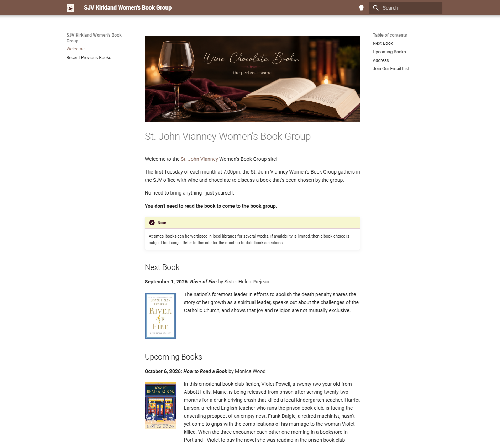
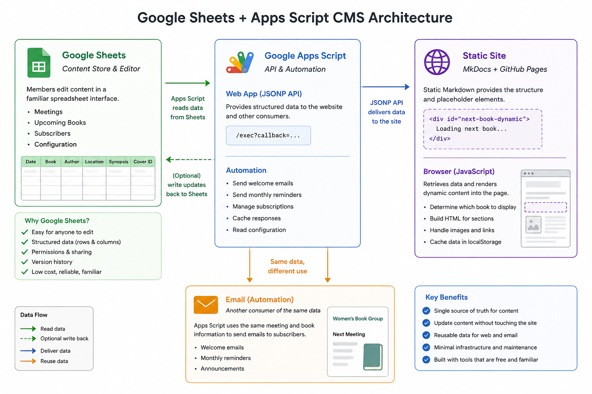
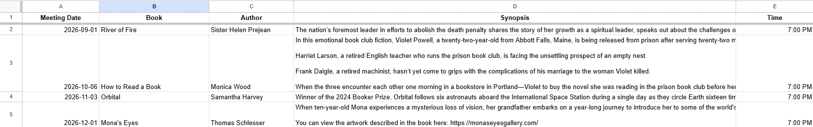
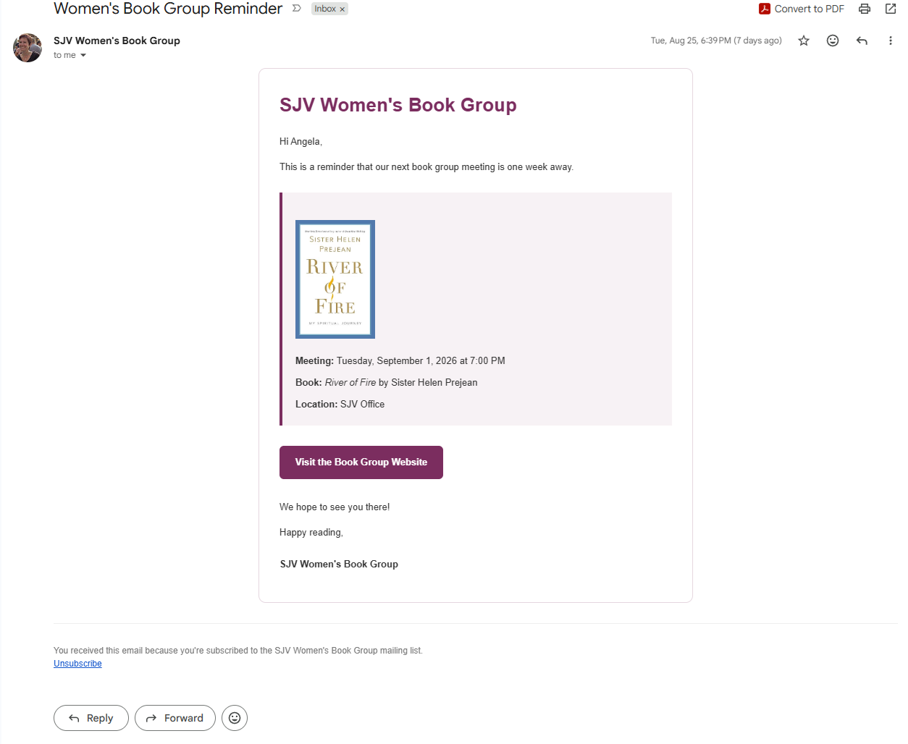
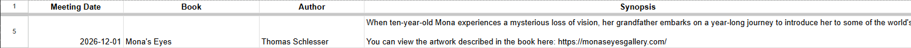

# I Built a Lightweight CMS with Google Sheets and GitHub Pages

<div class="blog-article__meta">
  <span>September 1, 2026</span>
  <span>Docs as code</span>
  <span>MkDocs</span>
  <span>GitHub Pages</span>
</div>

I help organize a women’s book group that meets once a month. We have a small website where members can see what we're reading, when and where we're meeting, and what's coming up next. The site is built with MkDocs and hosted on GitHub Pages. That works well for a small site, but there was one problem: updating it meant updating the site itself.

Every month, I needed to change the book, meeting date, location, synopsis, and other details in the site's Markdown files, then commit and publish those changes. None of that was particularly difficult, but it was repetitive. And as I started thinking about other things I wanted the site to do, like displaying book covers and sending email reminders, it became clear that the content shouldn't live directly in the website.

I needed a way to manage the book group's information separately from the site that displayed it. 

In other words, I needed a content management system.

But I didn't need WordPress, a database server, or an admin dashboard. This was a small site with a very small content model. I really just needed:

* A simple place to manage books and meeting information
* Structured data that the website could retrieve
* A way to update the site without editing its Markdown
* Something that could eventually support email subscriptions and reminders
* A system simple enough that I wouldn't spend more time maintaining it than using it

I was already using Google Sheets and GitHub Pages, so I decided to see how far I could get with those.

The result was a lightweight CMS built from Google Sheets, Google Apps Script, MkDocs, and a little JavaScript.



### About this post

Before you continue reading, keep in mind that this post is an overview of what I set out to accomplish, how the pieces fit together, and why I chose this approach. It isn't intended to be a step-by-step tutorial.

You can view the public repository for the static site on GitHub: [sjvkirkland/womens-book-group](https://github.com/sjvkirkland/womens-book-group).

If you're building something similar and have questions about the implementation or the scripts I used, feel free to reach out to me at [abartzmail@gmail.com](mailto:abartzmail@gmail.com).


## What I actually needed from a CMS

Before choosing any tools, I thought about what I actually needed to manage.

The content itself was pretty simple. For each meeting, I needed information like the book title, author, meeting date and location, a synopsis, and a cover image. I also wanted to keep information about upcoming books so members could see what we would be reading several months in advance.

But the website wouldn't be the only consumer of that information. For example, I wanted the same meeting date, book title, and book image that appeared on the website to also appear in reminder emails. But, I didn't want to maintain one version of that information on the website and then another in an email script.

That gave me a few basic requirements:

* **One source of truth.** Book and meeting information should be stored in one place and reused wherever I needed it.
* **Easy editing.** Updating a meeting shouldn't require changing code or editing a Markdown file.
* **Structured data.** The website needed to be able to retrieve individual fields such as the title, author, synopsis, date, location, and cover image.
* **Automation.** I wanted to be able to use the same data for things like email announcements and reminders.
* **Low maintenance.** This was a book group website, not a software product. I didn't want to maintain servers, databases, or another application just to keep the site running.

There was another requirement that became increasingly important as I worked on the project: **the editing experience should be simpler than the publishing system behind it.**

I might be comfortable editing Markdown, working with Git, and deploying a site from the command line, but none of that should be necessary just to change next month's book.

A spreadsheet already provides a surprisingly good interface for this kind of structured content. Each meeting can be a row, each piece of information can have its own column, and updating the content is as simple as editing a cell.

That made Google Sheets a natural place to start. Instead of treating the spreadsheet as something I would periodically copy information from, though, I decided to make it the source of truth for the site itself.

## The architecture

Once I decided to use Google Sheets as the source of truth, I needed a way to get that information from the spreadsheet to the website.

The system ended up having four main pieces, and each piece has a fairly small job.




### Google Sheets: The content store

The spreadsheet acts as both the data store and the editing interface.

I organized the information into separate tabs for different types of data:

* **Meetings** contains the book titles, authors, synopses, meeting dates and times, meeting locations, and cover images.
* **Subscribers** contains the book group's email subscribers.
* **Settings** contains configuration values used by the automation.
* **Log** records actions performed by the scripts.


For the website itself, the Meetings tab is the important part. Each row represents a meeting, and each column represents a specific piece of information about that meeting. 

Instead of storing a paragraph of formatted content, the spreadsheet stores individual values such as the book title, author, meeting date, location, and synopsis. Keeping those values separate makes it possible to use the same information in different ways.



### Google Apps Script: The application layer

Google Sheets gave me a place to store and manage the content, but the website still needed a way to retrieve it. That's where Google Apps Script comes in.

Apps Script reads the spreadsheet and converts the meeting information into structured data that the website can request. It also handles other parts of the system, including subscriber management and automated emails.

This means the spreadsheet doesn't need to know anything about the website, and the website doesn't need direct access to the spreadsheet. Apps Script sits between them.

### JavaScript: Connecting the data to the page

On the website, a small amount of JavaScript requests the meeting data from Apps Script. Once the data is returned, JavaScript builds the parts of the page that change from month to month: the current book, meeting information, synopsis, cover image, and upcoming books. The surrounding page, including the navigation, headings, layout, styles, and other static content, still comes from MkDocs.

### MkDocs and GitHub Pages: The presentation layer

MkDocs remains responsible for building the site, and GitHub Pages hosts the generated static files.

The important difference is that I no longer need to rebuild the site every time the book group chooses a new book or meeting details change. I just update the spreadsheet, and the website retrieves the updated information.

That separation is what made the project start to feel like a CMS rather than simply a static website connected to a spreadsheet. Google Sheets manages the content, Apps Script makes that content available, JavaScript renders the dynamic sections, and MkDocs and the site's stylesheet provide the surrounding structure and presentation.

None of the individual pieces is particularly complicated. The useful part is how they work together.

## Building it incrementally

I didn't start by designing a complete CMS. The first goal was much smaller: move the book and meeting information out of the website and into Google Sheets.

### Start with the meeting data

The first step was to move the book and meeting information into the Meetings tab and make that data available to the website through Apps Script.

That solved the original problem. I could change a book title, update a synopsis, or add an upcoming meeting in the spreadsheet without editing the website itself. Once that worked, it became much easier to add features.

### Add book covers

Book covers were a good example of a feature that sounded simple but introduced an interesting design question: where should the images live?

I stored the cover images in Google Drive and added a Cover Image field to the Meetings sheet. Instead of embedding an image in the spreadsheet, the field identifies the corresponding file in Drive. Apps Script retrieves that information and uses it to make the image available along with the rest of the meeting data, and the website displays it with the book information.

I also wanted to account for including books without an image, for example, in case an update needed to go out quickly, and there were multiple images of the book to choose from (which happened). The site handles a missing image without breaking the layout. That was a small implementation detail, but it reinforced an important rule for the project: the content should be allowed to be incomplete without breaking the presentation.

### Add subscribers

Once the website had reliable meeting data, I started thinking about communication.

Previously, managing a book group website and sending book group emails were separate tasks. But both depended on the same information.

I added a Subscribers tab to my Google Sheet and a signup form to the website. Apps Script handles the form submission, validates the email address, checks for existing subscribers, and either creates a new subscriber or reactivates someone who previously unsubscribed. 

The spreadsheet had now gone from storing website content to managing another type of structured information.

### Reuse the content for email

The next step was where having a single source of truth really started to pay off.

Instead of creating reminder emails separately, Apps Script could build them using the same meeting information already being displayed on the website. The book title, author, meeting date, location, synopsis, and cover image didn't need to be entered again. The email automation could retrieve them directly from the Meetings tab. 

I added emails for different points in the book group's monthly cycle, including a welcome email for new subscribers and two monthly reminders before the next meeting. 



Now, when I add a future meeting to the spreadsheet, I'm not just adding content to a website. I'm adding data that can be used throughout the system.

### Add configuration and logging

As the scripts grew, I also wanted to avoid scattering configuration values throughout the code, so I added a Settings tab for values such as the organizer name and email, meeting schedule, and email subject lines. I also added a Log tab so automated actions could leave a record of what happened.

Neither feature is particularly exciting on its own, but both make the system easier to understand and maintain. And that's essentially how the CMS grew: not from a list of CMS features I thought I should build, but from small problems I actually needed to solve.

Each time I added something, I tried to keep the same principle: store the information once, then let the different parts of the system use it.

## A Few Implementation Details

The complete Apps Script project handles quite a few things now, but the basic connection between Google Sheets and the website is relatively small.

Here are a few of the implementation details that made the system work.

### Turning spreadsheet rows into structured data

The Meetings tab is designed for people to edit, but the website needs structured data. Apps Script provides the bridge between the two. The script reads the rows in the Meetings sheet, uses the column headings to identify each field, and converts the spreadsheet data into objects that the website can use.

Conceptually, a row that looks like this in the spreadsheet:



becomes data that looks more like this:

```json
{
  "date": "2026-12-01",
  "title": "Mona's Eyes",
  "author": "Thomas Schlesser",
  "synopsis": "...".
  "location": "SJV Office"
}
```

That distinction is important. The website doesn't need to know which spreadsheet column contains the author or how dates are formatted in Google Sheets. Apps Script handles that translation.

### Making the data available to the website

Apps Script can be deployed as a web app, which gives the website an endpoint it can request. When the site makes a request, Apps Script reads the spreadsheet and returns the meeting information in a format JavaScript can work with.

That gives me a simple flow:

**Google Sheets → Apps Script → JSON → JavaScript**

The static site doesn't need a traditional backend or its own database. From the site's perspective, it simply requests some data and displays the result.

```javascript
function doGet(e) {
  const data = getPublicBooksData_();
  const json = JSON.stringify(data);

  const callback =
    e && e.parameter && e.parameter.callback
      ? cleanCellValue_(e.parameter.callback)
      : "";

  if (callback) {
    return ContentService
      .createTextOutput(`${callback}(${json});`)
      .setMimeType(
        ContentService.MimeType.JAVASCRIPT
      );
  }

  return ContentService
    .createTextOutput(json)
    .setMimeType(
      ContentService.MimeType.JSON
    );
}
```

!!! custom "Note"
    The actual endpoint also handles validation, errors, and unsubscribe requests, but the important part here is that it retrieves the public book data and returns it in a format the website can consume.

### Displaying the content with JavaScript

On the MkDocs site, the Markdown provides containers for the parts of the page that need dynamic content.

For example, the next-book section contains only a placeholder:

```html
<div id="next-book-dynamic">
  <p>Loading next book...</p>
</div>
```

JavaScript then retrieves the book data and renders the appropriate content into that container.

The response is divided into the next book, additional upcoming books, and previously read books:

```javascript
window.renderBookClubBooks = function (data) {
  if (!data || data.error) {
    showBooksError();
    return;
  }

  renderNextBook(data.next);
  renderUpcomingBooks(data.upcoming || []);
  renderPreviousBooks(data.previous || []);
};
```

Each rendering function is responsible for a different part of the page. For example, `renderNextBook()` finds the corresponding container and replaces the placeholder content with the HTML for the next scheduled book:

```javascript
function renderNextBook(book) {
  const container =
    document.getElementById("next-book-dynamic");

  if (!container) {
    return;
  }

  if (!book) {
    container.innerHTML =
      "<p>No upcoming book has been selected yet.</p>";
    return;
  }

  container.innerHTML =
    buildDetailedBookHtml(book);
}
```

The buildDetailedBookHtml() function then creates the full book entry, including the date, title, author, synopsis, and cover image when one is available. The generated HTML uses CSS classes defined in the site's stylesheet, so the presentation remains separate from the JavaScript that builds the content.

This keeps the Markdown relatively simple. MkDocs provides the page structure and the placeholders for dynamic sections, while JavaScript determines what book content belongs in those sections and builds the HTML needed to display it.

The script also does some additional work behind the scenes. It formats dates, creates Google Drive URLs for book covers, converts links in synopses into clickable links, escapes content before inserting it into HTML, and displays fallback messages when data isn't available.

It also caches book data in the browser's `localStorage`. If cached data from the same day is available, the site can display it immediately while requesting a fresh copy from Apps Script in the background.

So rather than updating individual fields on an otherwise static page, the JavaScript is effectively responsible for rendering the dynamic book sections of the site.


### Cache data that doesn't need to be retrieved constantly

Once the site was working, I also added caching.

Book group information doesn't change every few seconds. In fact, it might not change for weeks. There was no reason to repeatedly read and process the spreadsheet every time the website needed the same information.

Apps Script can cache the processed data for a period of time and return the cached version when possible.

The important part was making sure that cache didn't get in the way when I *did* make a change. I added logic to clear it when meeting information is edited, so updated content can become available without waiting for the cache to expire.

It's a small optimization, but it also makes the behavior of the system more intentional: cache when the data is stable; invalidate the cache when the source changes.

### Keep configuration out of the code

As the project grew, I also moved configurable values into the Settings tab. Things like the organizer name, meeting time, and email subject lines don't really belong in JavaScript constants buried inside a script. Putting them in the spreadsheet means I can change those values without modifying the code. It also reinforces the role Google Sheets plays in the system. It isn't simply a makeshift database. It's the administrative interface for the book group.

And that's one of the things I like most about this approach: the technical complexity stays behind a very ordinary interface. To manage the content, I don't need to think about APIs, JSON, JavaScript, or GitHub. I open a spreadsheet and edit a row or a cell.

## What I learned

The most interesting thing I learned from this project is that a CMS doesn't necessarily need to look like a CMS.

When I started, I thought of Google Sheets primarily as a convenient place to store the book group's information. As the project grew, though, I realized that the spreadsheet was serving many of the same purposes as a traditional content management system. It gave me a place to create and update content. It provided structure for that content. And, most importantly, it separated the content from the places where that content was ultimately published.

A few other lessons emerged along the way.

### Separate content from presentation

This was probably the biggest improvement over the original site.

When book information lived directly in Markdown, the content and its presentation were closely connected. Updating the content meant updating the website. Once the meeting information moved into Google Sheets, those became two separate concerns.

Google Sheets answers questions like: What book are we reading? Who wrote it? When are we meeting? The website answers a different question: How should that information be presented to someone visiting the site?

That separation made the content much easier to reuse. The same book title can appear in a website card, an upcoming-books list, or an email without maintaining three copies of it.

### Design the editing experience for the person maintaining the content

It's easy to focus on the experience of the person visiting a website and forget about the person maintaining it.

For this project, those happen to both be me. But I still don't want to edit source files, commit changes, and redeploy a site every time the book group chooses its next book.

The best editing interface wasn't something I needed to build. It was a spreadsheet. That's an idea I can apply to much larger content systems as well: the technology behind a publishing system can be complicated, but the experience of contributing content doesn't have to be.

### A single source of truth becomes more valuable as the system grows

Moving the meeting information into Google Sheets initially saved me a small amount of work. Its value became much more obvious as I added other features.

What started as a way to avoid updating Markdown became the source for the website, upcoming books, and automated emails. Each new use made the original decision to separate the content from the presentation more valuable.

It also reduced opportunities for mistakes. If the meeting location changes, I change it once.

That wasn't a major concern when the spreadsheet had only one consumer. It became much more important as the system grew.

### Build for the problem you actually have

I could have installed a traditional CMS. I could have created a database and an administrative application. Either approach would have given me far more capabilities.

But I didn't need them.

I needed to manage a relatively small amount of structured content for a book group.

Google Sheets and Apps Script have limitations, and I wouldn't choose this architecture for every project. But for this one, those limitations are a reasonable tradeoff for having a system that's inexpensive, understandable, and easy to maintain.

That may be my biggest takeaway from the project: a good content system isn't necessarily the one with the most features. It's the one that makes managing the content you actually have easier.

## When I would — and wouldn't — use this approach

I like how this system turned out, but I wouldn't recommend building every CMS with Google Sheets and Apps Script.

It works well for this project because the content is relatively small and structured, the number of people managing it is limited, and the publishing requirements are straightforward.

I would consider a similar approach for things like a small community website, internal project site, event calendar, club website, or other project where:

* The content fits naturally into rows and columns.
* Only a small number of trusted people need to edit it.
* The site doesn't need complex editorial workflows or permissions.
* Keeping infrastructure and maintenance to a minimum is important.
* The same structured information could be useful in more than one place.

There are also plenty of situations where I would choose something else.

If I needed hundreds of editors, complex permissions, versioning and approval workflows, relationships between many different content types, or a rich visual editing experience, I would want a CMS designed to provide those capabilities.

Google Sheets also isn't a database, and Apps Script isn't intended to be the backend for a large, high-traffic application. At some point, trying to extend this architecture would create more complexity than it eliminates.

But that's also part of what made this project interesting. I didn't set out to build a CMS. I set out to make a small, easy-to-maintain website.

Moving the content into Google Sheets solved that problem. Apps Script made the content reusable. Then that same foundation made it possible to add book covers, subscriptions, automated emails, caching, configuration, and other features without changing the basic architecture.

The result is still a static website hosted on GitHub Pages. But maintaining it no longer feels like maintaining a static website. Most of the time, I just open a spreadsheet and update the book group. And that's exactly what I wanted.

