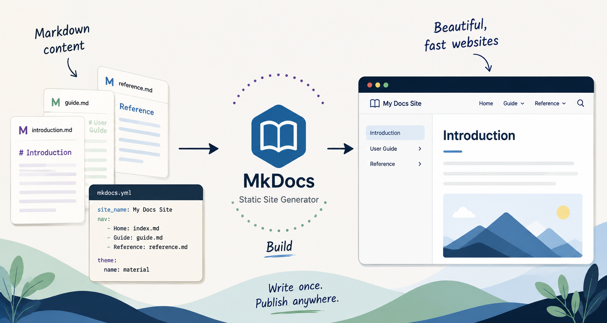

# Create a Website with MkDocs and GitHub Pages

<div class="blog-article__meta">
  <span>July 2, 2026</span>
  <span>Docs as code</span>
  <span>MkDocs</span>
  <span>GitHub Pages</span>
</div>

For several years, I paid for a website that hosted information about me and included my writing samples. But as a technical writer with years of GitHub and GitLab experience, I eventually wondered why I wasn't just building and hosting the site myself with open-source tools.

So I decided to rebuild my site with [MkDocs](https://www.mkdocs.org/) and publish it with GitHub Pages. This tutorial walks through the same basic process so you can create one for yourself.

## Before you begin

Before you start, you'll need:

- **Python** — Run `python --version` to check whether it's installed.
- **pip** — Run `pip --version` to check whether it's installed.
- **A text editor** — I use Visual Studio Code.
- **A public GitHub repository** — You'll use this to store your source files and publish the site with GitHub Pages.

You'll also want a basic understanding of [GitHub](https://docs.github.com/en/get-started), Git, and [Markdown](https://www.markdownguide.org/cheat-sheet/).

## Installation

Run the following command to install MkDocs:

```
pip install mkdocs
```

!!! tip
    Open a Terminal in VS Code or in your editor to run these commands. 

## Create your project

Now that MkDocs is installed, run the following commands to create your project. The example below creates a project called **my-project** and stores it in the **C:\Users\<username\>\repository\my-site** folder.

    # Change directories to the repository where you'll store these files.
    # This assumes you have a GitHub repository called "my-site".
    cd ~\repository\my-site

    # Create the new project
    mkdocs new my-project

Next, run the following command to change directories and see what MkDocs built.

    # Change directories to the new project
    cd my-project

The ```mkdocs new``` command creates a new folder with the name of your site along with two other files:

- **mkdocs.yml**: This is the main configuration file for your site and includes your site's navigation.
- **index.md**: This is the front or home page of your site.

These files are enough to see your site in action. Run the following command to launch the site on a local web server:

```
mkdocs serve
```

!!! note
    Keep this Terminal window open while working on your site. The server will maintain a log of events that it encounters while you make updates.

To see the site, open a browser and navigate to 127.0.0.1:8000 (or localhost:8000). You should see a basic page that looks similar to the following image:

{ style="width: 75%" }

## Update the front page

At this point, you'll want to update the **index.md** file and personalize your front page. This is where understanding Markdown comes in handy. You can delete everything on the current **index.md** file and add your own content. You can see what my **index.md** file looks like by viewing it in my [repository](https://raw.githubusercontent.com/ABartzGit/angelabartz/refs/heads/main/ab-project/docs/index.md).

!!! tip
    When your browser is open to your site, your site will automatically reload with your changes each time you save a file. If it doesn't automatically reload, stop the server by pressing ```Ctrl + C``` in your Terminal, then restart the server using ```mkdocs serve --livereload```.

## Add another page

When adding pages and files, be aware of your project's file structure. In my site, any page that's a top-level page in my navigation is stored directly in the **/docs** folder. I store my blog posts in a **/docs/blog** folder. And I store my images in a **/docs/images** folder. 

!!! note
    MkDocs site content is stored in the **/docs** folder, while the **mkdocs.yml** configuration file is stored at the project root.

Now let's create a new file called **my-portfolio.md** in the **/docs** folder. 

```
# My portfolio

This page shows some of my work from over the years.

```

In the **mkdocs.yml** file, add the new **my-portfolio.md** page to your site's ```nav``` element. 

```
site_name: My Docs
site_url: https://example.com/
nav:
    - Home: index.md
    - My portfolio: my-portfolio.md
```

## Change the theme

MkDocs installs two themes by default: ```mkdocs``` and ```readthedocs```. In your **mkdocs.yml** file, change the theme to ```readthedocs``` and see how your site changes.

```
site_name: My Docs
site_url: https://example.com/
nav:
    - Home: index.md
    - My portfolio: my-portfolio.md
theme: readthedocs
```

There are a number of third-party themes that you can choose from to personalize your project. These are available at the following sites:

- [MkDocs themes](https://pawamoy.github.io/mkdocs-gallery/)
- [MkDocs themes catalog](https://github.com/mkdocs/catalog#-theming) 

After you choose and install the theme you want, just change the ```theme``` element in the **mkdocs.yml** file. In fact, review the documentation for your theme to see all of the additional configurations you can add to your **mkdocs.yml** file. You can view [my yml file](https://raw.githubusercontent.com/ABartzGit/angelabartz/refs/heads/main/ab-project/mkdocs.yml), which is pretty basic, but so far does all that I need.

## Build the site

After you add all your pages, if everything looks good, then you're ready to build the site. This is a simple process using the ```build``` command.

```
# Stop the local server by pressing Ctrl + C in your Terminal.
# Build the site
mkdocs build
```

The ```build``` command will generate a static website in a new **/site** folder, which sits directly under your project folder. At this point, you can take that folder and deploy your site on a web server. Or you can deploy it in [GitHub Pages](https://docs.github.com/en/pages).

### Add a .gitignore file

You don't want to check or track documentation builds in your repository. The files within the **site/** folder are simply output files rather than source files. Create a .gitignore file and add the contents of the **site/** folder to it so that these files aren't tracked.

```
echo "site/" >> .gitignore
```

Now verify that the **site/** folder is ignored.

```
git status
```

You shouldn't see the **site/** folder in the output of ``git status``. If you do see **site/**, it could be that git is saving your .gitignore file with the wrong text encoding (like UTF-16 instead of UTF-8) or it contains a hidden character called a Byte Order Mark (BOM). Run the following commands to fix the gitignore file.

```
# Run this command in your PowerShell terminal to rewrite the file cleanly:
Set-Content -Path .gitignore -Value "site/" -Encoding utf8

# Run this command to verify that Git actually reads the text inside the file now:
git check-ignore -v site/index.html

# Run this command to verify the site file is ignored:
git status
```

## Check in your source files

Before deploying, commit and push your source files to GitHub.

```
# Review the list of new and changed files
git status

# Add the new and changed files to the repo
git add .

# Commit the changes
git commit -m "Initial checkin of my project"

# Push the changes to the repository
git push
```


## Deploy the site in GitHub Pages

Now that everything is checked in, you can deploy your site in [GitHub Pages](https://docs.github.com/en/pages) by running the following command:

```
mkdocs gh-deploy
```

And that's it! After GitHub finishes the deployment, you can see your site live at:

```
<yourGitHubHandle>.github.io/<yourRepository>
```

## Where to go next

At this point, you have a working MkDocs site stored in GitHub and published with GitHub Pages. From here, you can start treating it like any other docs-as-code project.

Some useful next steps include:

- Choose and customize a theme.
- Add additional pages and navigation.
- Create custom CSS for your site's design.
- Add images and other assets.
- Explore MkDocs plugins and extensions.
- Set up a custom domain.

And because the site's source lives in GitHub, every change can be versioned, reviewed, and deployed using the same Git workflow you might use for a documentation project.
