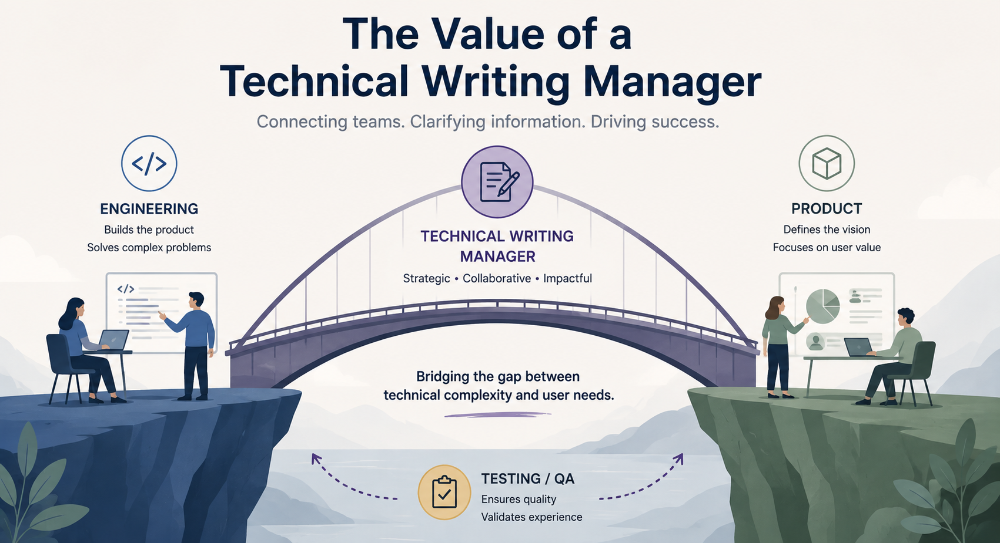

# The Value of a Technical Writing Manager

  June 8, 2026
  Technical writing leadership
  Documentation management

Everyone in the tech industry is familiar with the roles of a product manager
and a program manager. But in my experience, fewer companies fully understand
the role of a technical writing manager, let alone the range of value that role 
can provide.

When people think about technical writing managers, they often picture someone
overseeing documentation projects and managing a team of writers. While that's
certainly part of the job, the role also has a lot in common with product
management, program management, and business leadership.

## Product management: deciding what to build

Like product managers, technical writing managers spend a significant amount of
time deciding what work should happen next.

We gather input from internal customers, engineers, support teams, and other
stakeholders, then prioritize documentation efforts based on user needs and
business goals. Building a documentation roadmap isn't all that different from
building a product roadmap: we balance competing priorities, make tradeoffs, and
focus the team on the work that will have the most impact.

## Program management: making it happen

Technical writing managers also wear a program manager hat.

Documentation rarely exists in a vacuum. It depends on product launches,
engineering milestones, and cross-functional collaboration. Keeping
documentation projects on track means managing timelines, tracking progress,
coordinating across teams, identifying risks before they become blockers, and
making sure everything comes together when it needs to.

## Business leadership: building a team that can scale

Technical writing managers aren't just responsible for producing content.
They're also responsible for ensuring the team has the people, tools, and
processes necessary to scale documentation effectively.

This financial and operational side of the role often goes unnoticed. I've been
responsible for my team's budget and have had to decide where to invest
resources, whether through headcount or tools, and how to maximize the impact
of the documentation team.

Much like an engineering manager or product leader, a technical writing manager
has to evaluate costs, forecast future needs, and justify investments to
leadership.

The result is a role that sits at the intersection of content, product, and
operations.

## More than documentation output

A strong technical writing manager does much more than manage documentation
output. The role combines content leadership with prioritization, planning,
cross-functional coordination, resource management, and business decision-making.

If you're hiring a technical writing manager, you're not simply hiring someone
to manage writers and documentation projects. You're hiring someone who can
help determine what the organization should document, coordinate how that work
gets delivered, and build the systems and team needed to do it effectively.
